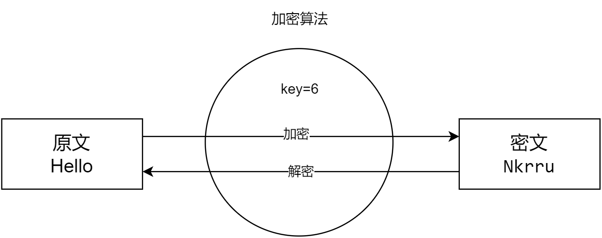
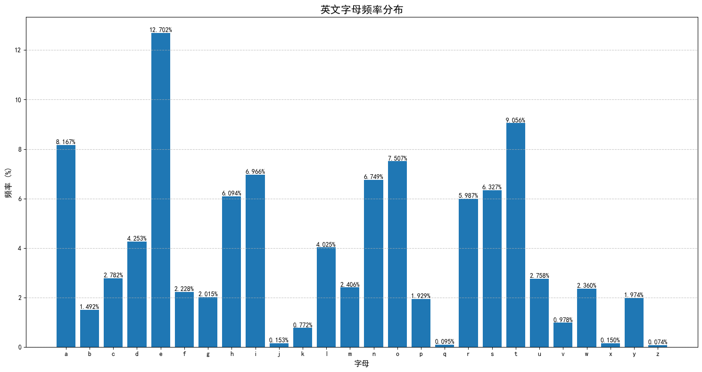
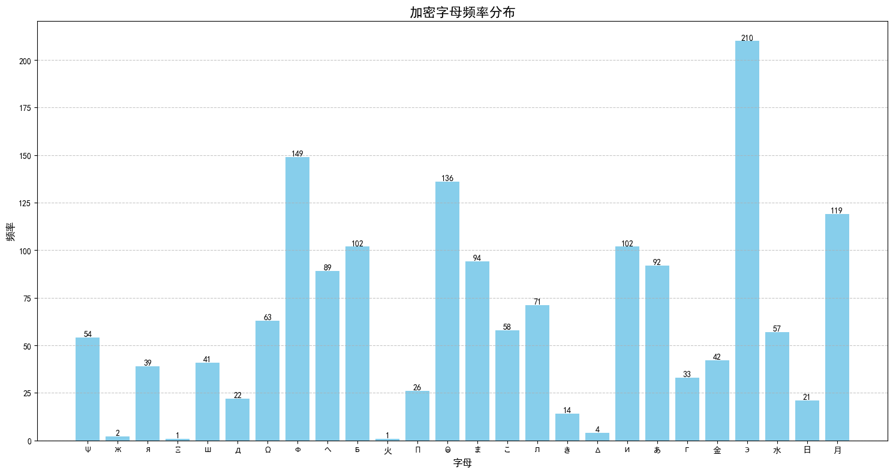

## 古典密码——凯撒加密到玛丽一世之死

凡是人就有自己的秘密与隐私，如果我们能够一直由自己保存那自然最好。但实际中我们需要将一些秘密传递给某些人而不被其他人破解，这就产生了秘密泄露的风险。如果传信的人背叛了自己，或是在途中被截获，那么我们的秘密就处于危险。所以如果我们不加保护，可能会产生可怕的后果，甚至是死亡。这就是密码学产生的原因。

### 什么是密码
密码这个词似乎经常出现在我们身边，登录QQ需要QQ密码，进入公司的系统需要职工密码，从银行取钱需要银行卡密码。
但是今天我要谈论的密码并不是这些密码。QQ密码其实并不是一种密码(Cipher)而应该叫做口令(password)，将这两个单词都翻译为密码似乎不是很严谨。那么我们说的Cipher是什么呢？

密码，应该是一种用于执行加密和解密的算法。它应该有四个基本的要素：密钥、原文、密文、加密算法。



我们事先约定一个密钥(key)，在写信时我们使用这个密钥进行加密获取密文，密文是一段无法阅读的文本，传信人将密文传递给收信人，中间即使被截获也不会被他人发现秘密。而收信人拥有密钥，在收到信后可以推导出原文。这样便保护了秘密不被中途截获破解。

### 凯撒密码
凯撒这个名字已经和密码学不可分离了。作为一个卓越的征服者，他每每有秘密命令需要传递，他便使用密码来写。他使用的密码原理十分简单，或许你在小学传秘密纸条时也和这位传奇人物一样想到了这个方法。他将原文中的字母都按照字母表的顺序进行一次移位，把A换成B，把B换成C，到了Z的时候把它又换成A，这样每个字母都进行了一次变化。密钥便是移位的跨度，这里的密钥便是1.


上面的图中便是将Hello作为原文，密钥为6的凯撒加密。密文中每个字母都是原文中的字母向后移位6个位置产生的。

下面我们使用python实现这个算法

```py
class CaesarCipher:
    def encrypt(self, text, key):
        result = ""
        for i in text:
            if i.isupper():
                result += chr((ord(i) + key - ord('A')) % 26 + ord('A'))
            elif i.islower():
                result += chr((ord(i) + key - ord('a')) % 26 + ord('a'))
            else:
                result += i
        return result

    def decrypt(self, text, key):
        result = ""
        for i in text:
            if i.isupper():
                result += chr((ord(i) - key - ord('A')) % 26 + ord('A'))
            elif i.islower():
                result += chr((ord(i) - key - ord('a')) % 26 + ord('a'))
            else:
                result += i
        return result

text = "Hello"
key = 6
cipher = CaesarCipher()
ciphertext = cipher.encrypt(text, key)
print(ciphertext)
print(cipher.decrypt(ciphertext, key))
```

**凯撒加密的破绽**
你经过刚刚的介绍，你可能已经发现了凯撒加密的一个问题。那就是英文字母一共就26个，加密的密钥范围就是0-25，当密钥为26时效果和0是一致的。那么，我们只需要遍历0到25，其中就必须有一个是原文，我们只需要找到里面那个看上去像是一个句子的结果就是原文了。同时凯撒加密还有个问题就是，我们无法通过多次加密来提升破解的难度，我们依次以key=1和key=2进行加密，得到的结果就是key=3的加密结果，并没有提升解密的难度。

你可能会觉得，堂堂凯撒大帝就使用这么简单的方法加密信件？但是，考虑到当时大部分人其实是文盲，文字本身对很多人就已经是密文了，这个加密方式还是比较靠谱的。

现在想象一下，有一天你在你女儿桌上看到这么一封信，包装十分精美华丽，里面只有下面这一句不明所以的话:

> Mvy fvb, P dvbsk zalhs zahyz myvt aol upnoa zrf huk wshjl aolt pu fvby olhya, zv fvb dvbsk ulcly il hmyhpk vm aol khyr.

那么你就可以尝试一下，看看这个是不是凯撒加密。我们将前10个字母进行解密，遍历key=0到key=25。我们发现里面key=7一行很明显是一个句子的开头

```
1 Lux eua, O
2 Ktw dtz, N
3 Jsv csy, M
4 Iru brx, L
5 Hqt aqw, K
6 Gps zpv, J
7 For you, I
8 Enq xnt, H
9 Dmp wms, G
10 Clo vlr, F
11 Bkn ukq, E
12 Ajm tjp, D
13 Zil sio, C
14 Yhk rhn, B
15 Xgj qgm, A
16 Wfi pfl, Z
17 Veh oek, Y
18 Udg ndj, X
19 Tcf mci, W
20 Sbe lbh, V
21 Rad kag, U
22 Qzc jzf, T
23 Pyb iye, S
24 Oxa hxd, R
25 Nwz gwc, Q
```

我们使用key=7进行解密，发现原文是
> For you, I would steal stars from the night sky and place them in your heart, so you would never be afraid of the dark.

这句话似乎有些暧昧了，你或许需要开始筛查女儿身边的黄毛了。

### 玛丽一世之死

十六世纪末，一群天主教贵族策划了一场"巴宾顿阴谋"。计划很简单：暗杀当时的英格兰女王伊丽莎白一世，让被软禁的玛丽登上王位。为了与外界联络，玛丽和共谋者们使用了一种复杂的替换密码系统。他们将信件藏在啤酒桶的木塞中，通过啤酒运送来传递密文。

然而，伊丽莎白一世的情报主管沃尔辛厄姆安插的间谍截获了这些信件，他手下的密码专家菲利普斯成功破解了这个密码系统。菲利普斯发现这个密码使用了一种复杂的替换表，他通过频率分析和一些已知的固定用语，逐步还原出了整个密码表。他们在收到一份密信后对信进行了复制，并在最后添加了一段使用该加密算法生成的密文，询问本次阴谋的主谋有哪些。最后，这些密信作为审判的证据，伊丽莎白于1586年10月下令对玛丽进行审判并处决她，该判决于1587年2月8日执行。

我们想象一下：

现在你还没有找到给你女儿寄暧昧句子的那个黄毛，但是你今天在家门口的花盆下看到这样一封信。这看上去是毫无逻辑的一堆文字，勉强看上去像是一封密信。(假设我们知道这个密信的原文是英文)

>こΨ 水Э月БЭへФ ЭЛИЖ月日ЭФあ,
>
>月へ И へИФ あЭБЭ 日ЭまЭ月Фあ ФあЭ へФ月БЛИФ へきΨ, こΨ ФあΘΩГあФへ ИまЭДИФ月日ЛΨ 水БИ金Ф ФΘ ΨΘΩ, 月へ ФあЭΨ 月ЛШ月Ψへ 水Θ ШあЭま ФあЭ ШΘБЛ水 ГБΘШへ 火ΩИЭФ 月ま水 ФあЭ ЭДЭまИまГ 日БЭЭЖЭ Я月ББИЭへ ФあЭ へШЭЭФ へЯЭまФ Θ金 Δ月へこИまЭ. Э月Яあ へФ月Б 月日ΘДЭ БЭこИま水へ こЭ Θ金 ФあЭ へΠ月БきЛЭ Иま ΨΘΩБ ЭΨЭへ ШあЭま ΨΘΩ Л月ΩГあ, 月ま水 ФあЭ こΘΘま'へ ГЭまФЛЭ ГЛΘШ Π月ЛЭへ Иま ЯΘこΠ月БИへΘま ФΘ ΨΘΩБ Б月水И月まФ へこИЛЭ.
>
>へИまЯЭ Фあ月Ф 金月ФЭ金ΩЛ 月ΩФΩこま 水月Ψ ШあЭま ШЭ 金ИБへФ こЭФ Иま ФあЭ ΘЛ水 日ΘΘきへあΘΠ, こΨ ШΘБЛ水 あ月へ 日ЭЭま ФБ月まへ金ΘБこЭ水. И БЭこЭこ日ЭБ あΘШ ΨΘΩ БЭ月ЯあЭ水 金ΘБ Фあ月Ф ШΘБま ЯΘΠΨ Θ金 ΠБИ水Э 月ま水 ΠБЭΔΩ水ИЯЭ ΔΩへФ 月へ И 水И水, ΘΩБ あ月ま水へ 日БИЭ金ЛΨ ФΘΩЯあИまГ, 月ま水 あΘШ ШЭ へΠЭまФ ФあЭ まЭΞФ ФあБЭЭ あΘΩБへ 水ИへЯΩへへИまГ ЛИФЭБ月ФΩБЭ ΘДЭБ ЯΘ金金ЭЭ. ΨΘΩБ Π月へへИΘま 金ΘБ ШΘБ水へ, ΨΘΩБ 日БИЛЛИ月まФ こИま水, 月ま水 ΨΘΩБ きИま水 あЭ月БФ あ月ДЭ Я月ΠФИД月ФЭ水 こЭ ЯΘこΠЛЭФЭЛΨ.
>
>ЭДЭБΨ こΘこЭまФ ШЭ へΠЭま水 ФΘГЭФあЭБ 金ЭЭЛへ ЛИきЭ 月 ΠБЭЯИΘΩへ ГИ金Ф. ФあЭ Ш月Ψ ΨΘΩ へЯБΩまЯあ ΨΘΩБ まΘへЭ ШあЭま ΨΘΩ'БЭ 水ЭЭΠ Иま ФあΘΩГあФ, あΘШ ΨΘΩ 月ЛШ月Ψへ БЭこЭこ日ЭБ ФΘ 金ЭЭ水 ФあЭ へФБ月Ψ Я月Фへ Иま ФあЭ Π月Бき, 月ま水 ΨΘΩБ Иま金ЭЯФИΘΩへ Л月ΩГあФЭБ Фあ月Ф Я月ま 日БИГあФЭま ЭДЭま ФあЭ ГЛΘΘこИЭへФ Θ金 水月Ψへ - ФあЭへЭ ЛИФФЛЭ ФあИまГへ こ月きЭ こΨ あЭ月БФ へШЭЛЛ ШИФあ 月金金ЭЯФИΘま.
>
>И 金Иま水 こΨへЭЛ金 ЯΘЛЛЭЯФИまГ へこ月ЛЛ こΘこЭまФへ ФあБΘΩГあΘΩФ こΨ 水月Ψ Фあ月Ф И Ш月まФ ФΘ へあ月БЭ ШИФあ ΨΘΩ - 月 金ΩままΨ ЯΘまДЭБへ月ФИΘま ΘДЭБあЭ月Б水 Θま ФあЭ ФБ月Иま, 月 日Э月ΩФИ金ΩЛ へΩまへЭФ Фあ月Ф БЭこИま水Э水 こЭ Θ金 ΨΘΩБ Ш月ФЭБЯΘЛΘБ Π月ИまФИまГへ, ΘБ へИこΠЛΨ 月 Б月ま水Θこ ФあΘΩГあФ Фあ月Ф こ月水Э こЭ へこИЛЭ. ΨΘΩ あ月ДЭ 日ЭЯΘこЭ こΨ 金ИБへФ ФあΘΩГあФ Иま ФあЭ こΘБまИまГ 月ま水 こΨ Л月へФ ФあΘΩГあФ 日Э金ΘБЭ へЛЭЭΠ ЯЛ月Иこへ こЭ Э月Яあ まИГあФ.
>
>ФΘこΘББΘШ ЭДЭまИまГ, И ШΘΩЛ水 ЛΘДЭ ФΘ Ф月きЭ ΨΘΩ へΘこЭШあЭБЭ へΠЭЯИ月Л. ФあЭБЭ'へ 月 あИ水水Эま Г月Б水Эま まЭ月Б ФあЭ ΘЛ水 Я月ФあЭ水Б月Л Фあ月Ф ЯΘこЭへ 月ЛИДЭ ШИФあ ФあΘΩへ月ま水へ Θ金 金ИБЭ金ЛИЭへ 月Ф 水Ωへき. ШΘΩЛ水 ΨΘΩ 水Θ こЭ ФあЭ あΘまΘБ Θ金 Ш月ФЯあИまГ ФあИへ こ月ГИЯ月Л 水ИへΠЛ月Ψ ШИФあ こЭ? ШЭ ЯΘΩЛ水 日БИまГ 月 ΠИЯまИЯ 日月へきЭФ, へΘこЭ Θ金 Фあ月Ф へФБ月Ш日ЭББΨ ШИまЭ ΨΘΩ ЛΘДЭ, 月ま水 ЯБЭ月ФЭ 月まΘФあЭБ 日Э月ΩФИ金ΩЛ こЭこΘБΨ ФΘГЭФあЭБ.
>
>И金 ΨΘΩ'БЭ ШИЛЛИまГ ФΘ ΔΘИま こЭ Θま ФあИへ ЛИФФЛЭ 月水ДЭまФΩБЭ, こЭЭФ こЭ 月Ф ΘΩБ 金月ДΘБИФЭ ЯΘ金金ЭЭ へあΘΠ 月Ф へЭДЭま Θ'ЯЛΘЯき ФΘこΘББΘШ ЭДЭまИまГ. И'ЛЛ 日Э Ш月ИФИまГ ШИФあ 月 へИまГЛЭ БЭ水 БΘへЭ 月ま水 こΨ あЭ月БФ 金ΩЛЛ Θ金 あΘΠЭ.
>
>金ΘБЭДЭБ ΨΘΩБへ,
>ШИЛЛИ月こ
>
>Π.へ. - ШЭ月Б Фあ月Ф 日ЛΩЭ 水БЭへへ ΨΘΩ ЛΘДЭ - ФあЭ ΘまЭ Фあ月Ф こ月きЭへ ΨΘΩ ЛΘΘき ЛИきЭ ΨΘΩ'ДЭ へФЭΠΠЭ水 ΘΩФ Θ金 月 金月ИБΨ Ф月ЛЭ.


那么，我们应该如何破译这个密文呢？很明显这个密信不是通过凯撒加密获得的，因为这里头有很多没有关联的字符，既有汉字又有日文俄文等等。别着急，我们数一下可以发现，除了标点符号，全部只有26种符号，我们可以猜测这个文章使用的是某种替换加密，将某个字母替换成了另外的字符。

我们知道，英文中不同的字母使用频率不一样，大致分布如下图所示，e是频率最高的，然后是a,o,t。而j,q,x,z使用频率最低


于是我们将本文的字母频数统计出来

可以看到Э频率最高，我们暂且推测它是e

然后是 Ф , Θ , 月,这个可能是a,o,t

而最少的明显有 Ж , Ξ , 火 , Δ ，这四个出现次数都是个位数，极有可能是jqxz四个字母



我们继续观察，可以看到密信中长度为1的单词是 'И', '月'。
长度为2的有['こΨ', '月へ', 'ФΘ', '水Θ', 'Θ金', 'こЭ', 'Иま', 'ШЭ', 'Θま', 'ΘБ', '月Ф', 'И金', '日Э', 'Πへ']

首先，英文中最常见的单个字母的单词是a和i，我们可以猜测'И' : i , '月' : a
那么'月Ф'很可能就是 at ，那么Θ大概率对应t

再来，结合频率表，我们发现'月へ'很可能是'as'，而'日Э'可能是'be'

这样一直推下去，我们可以获得下面这个替换表(在这里起密钥的作用)

| 原文 | 密文 | 原文 | 密文 | 原文 | 密文 |
|--------|----------|--------|----------|--------|----------|
| A      | 月       | J      | Δ        | S      | へ       |
| B      | 日       | K      | き       | T      | Ф        |
| C      | Я        | L      | Л        | U      | Ω        |
| D      | 水       | M      | こ       | V      | Д        |
| E      | Э        | N      | ま       | W      | Ш        |
| F      | 金       | O      | Θ        | X      | Ξ        |
| G      | Г        | P      | Π        | Y      | Ψ        |
| H      | あ       | Q      | 火       | Z      | Ж        |
| I      | И        | R      | Б        |        |          |

我们使用这个替换表解密密信，得到下面的明文:

>MY DEAREST ELIZABETH,
>
>AS I SIT HERE BENEATH THE STARLIT SKY, MY THOUGHTS INEVITABLY DRIFT TO YOU, AS THEY ALWAYS DO WHEN THE WORLD GROWS QUIET AND THE EVENING BREEZE CARRIES THE SWEET SCENT OF JASMINE. EACH STAR ABOVE REMINDS ME OF THE SPARKLE IN YOUR EYES WHEN YOU LAUGH, AND THE MOON'S GENTLE GLOW PALES IN COMPARISON TO YOUR RADIANT SMILE.
>
>SINCE THAT FATEFUL AUTUMN DAY WHEN WE FIRST MET IN THE OLD BOOKSHOP, MY WORLD HAS BEEN TRANSFORMED. I REMEMBER HOW YOU REACHED FOR THAT WORN COPY OF PRIDE AND PREJUDICE JUST AS I DID, OUR HANDS BRIEFLY TOUCHING, AND HOW WE SPENT THE NEXT THREE HOURS DISCUSSING LITERATURE OVER COFFEE. YOUR PASSION FOR WORDS, YOUR BRILLIANT MIND, AND YOUR KIND HEART HAVE CAPTIVATED ME COMPLETELY.
>
>EVERY MOMENT WE SPEND TOGETHER FEELS LIKE A PRECIOUS GIFT. THE WAY YOU SCRUNCH YOUR NOSE WHEN YOU'RE DEEP IN THOUGHT, HOW YOU ALWAYS REMEMBER TO FEED THE STRAY CATS IN THE PARK, AND YOUR INFECTIOUS LAUGHTER THAT CAN BRIGHTEN EVEN THE GLOOMIEST OF DAYS - THESE LITTLE THINGS MAKE MY HEART SWELL WITH AFFECTION.
>
>I FIND MYSELF COLLECTING SMALL MOMENTS THROUGHOUT MY DAY THAT I WANT TO SHARE WITH YOU - A FUNNY CONVERSATION OVERHEARD ON THE TRAIN, A BEAUTIFUL SUNSET THAT REMINDED ME OF YOUR WATERCOLOR PAINTINGS, OR SIMPLY A RANDOM THOUGHT THAT MADE ME SMILE. YOU HAVE BECOME MY FIRST THOUGHT IN THE MORNING AND MY LAST THOUGHT BEFORE SLEEP CLAIMS ME EACH NIGHT.
>
>TOMORROW EVENING, I WOULD LOVE TO TAKE YOU SOMEWHERE SPECIAL. THERE'S A HIDDEN GARDEN NEAR THE OLD CATHEDRAL THAT COMES ALIVE WITH THOUSANDS OF FIREFLIES AT DUSK. WOULD YOU DO ME THE HONOR OF WATCHING THIS MAGICAL DISPLAY WITH ME? WE COULD BRING A PICNIC BASKET, SOME OF THAT STRAWBERRY WINE YOU LOVE, AND CREATE ANOTHER BEAUTIFUL MEMORY TOGETHER.
>
>IF YOU'RE WILLING TO JOIN ME ON THIS LITTLE ADVENTURE, MEET ME AT OUR FAVORITE COFFEE SHOP AT SEVEN O'CLOCK TOMORROW EVENING. I'LL BE WAITING WITH A SINGLE RED ROSE AND MY HEART FULL OF HOPE.
>
>FOREVER YOURS,
>WILLIAM
>
>P.S. - WEAR THAT BLUE DRESS YOU LOVE - THE ONE THAT MAKES YOU LOOK LIKE YOU'VE STEPPED OUT OF A FAIRY TALE.

这是一篇优秀的情书，唯一不好的一点是这是一个叫William的黄毛写给你女儿的。但是你女儿现在显然还没有看到这封情书，于是破译了密码的你选择动一动手脚，你以William的名义写了一篇劝学，希望你女儿能够好好学习，等考上了好大学再谈恋爱。

>Dear Elizabeth,
>
>I write this letter with sincere concern for your future. Your recent academic performance has been declining, and I know this isn't the brilliant student I met in the library last autumn. You have such extraordinary potential - you were our grade's top student and national essay competition winner.
>
>I care about you deeply, which is why I must be honest: we should focus on our studies right now. The university entrance exams are approaching, and this time is crucial for both our futures. Let's make a promise: after we both get into excellent universities, we can reconsider our relationship.
>
>You are too precious to let momentary feelings jeopardize your bright future.
>
>With sincere concern,
>William
>
>P.S. - Study hard and get into your dream university.

你加密成了密文，然后把信重新塞到花盆下面。

>水Э月Б ЭЛИЖ月日ЭФあ,
>
>И ШБИФЭ ФあИへ ЛЭФФЭБ ШИФあ へИまЯЭБЭ ЯΘまЯЭБま 金ΘБ ΨΘΩБ 金ΩФΩБЭ. ΨΘΩБ БЭЯЭまФ 月Я月水ЭこИЯ ΠЭБ金ΘБこ月まЯЭ あ月へ 日ЭЭま 水ЭЯЛИまИまГ, 月ま水 И きまΘШ ФあИへ Иへま'Ф ФあЭ 日БИЛЛИ月まФ へФΩ水ЭまФ И こЭФ Иま ФあЭ ЛИ日Б月БΨ Л月へФ 月ΩФΩこま. ΨΘΩ あ月ДЭ へΩЯあ ЭΞФБ月ΘБ水Иま月БΨ ΠΘФЭまФИ月Л - ΨΘΩ ШЭБЭ ΘΩБ ГБ月水Э'へ ФΘΠ へФΩ水ЭまФ 月ま水 ま月ФИΘま月Л Эへへ月Ψ ЯΘこΠЭФИФИΘま ШИままЭБ.
>
>И Я月БЭ 月日ΘΩФ ΨΘΩ 水ЭЭΠЛΨ, ШあИЯあ Иへ ШあΨ И こΩへФ 日Э あΘまЭへФ: ШЭ へあΘΩЛ水 金ΘЯΩへ Θま ΘΩБ へФΩ水ИЭへ БИГあФ まΘШ. ФあЭ ΩまИДЭБへИФΨ ЭまФБ月まЯЭ ЭΞ月こへ 月БЭ 月ΠΠБΘ月ЯあИまГ, 月ま水 ФあИへ ФИこЭ Иへ ЯБΩЯИ月Л 金ΘБ 日ΘФあ ΘΩБ 金ΩФΩБЭへ. ЛЭФ'へ こ月きЭ 月 ΠБΘこИへЭ: 月金ФЭБ ШЭ 日ΘФあ ГЭФ ИまФΘ ЭΞЯЭЛЛЭまФ ΩまИДЭБへИФИЭへ, ШЭ Я月ま БЭЯΘまへИ水ЭБ ΘΩБ БЭЛ月ФИΘまへあИΠ.
>
>ΨΘΩ 月БЭ ФΘΘ ΠБЭЯИΘΩへ ФΘ ЛЭФ こΘこЭまФ月БΨ 金ЭЭЛИまГへ ΔЭΘΠ月Б水ИЖЭ ΨΘΩБ 日БИГあФ 金ΩФΩБЭ.
>
>ШИФあ へИまЯЭБЭ ЯΘまЯЭБま,
>ШИЛЛИ月こ
>
>Π.へ. - へФΩ水Ψ あ月Б水 月ま水 ГЭФ ИまФΘ ΨΘΩБ 水БЭ月こ ΩまИДЭБへИФΨ.

这下，可怜的William的爱情也和玛丽一世一样被密码学扼杀。
